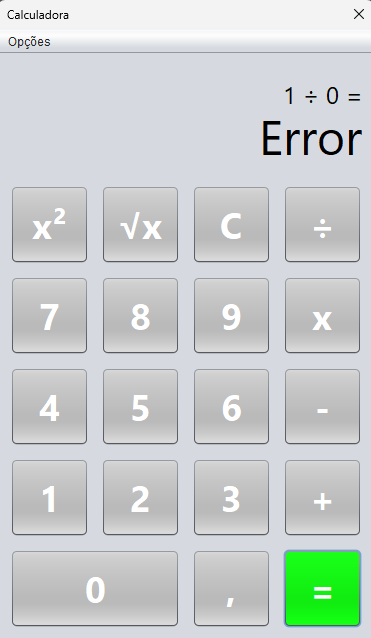
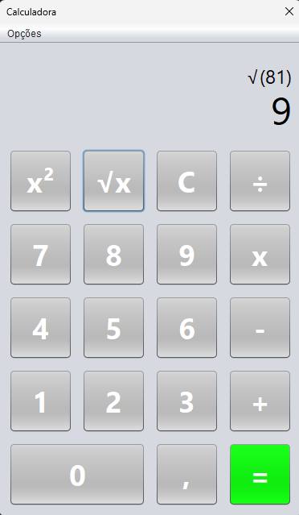

# Java Calculator

This is a calculator developed in Java during the 4th semester of university and it supports both basic and advanced mathematical operations with a graphical user interface.

## Features
- **Basic Operations**: Addition, subtraction, multiplication, and division
- **Advanced Functions**: Square root (√x) and exponentiation (x²)
- **Decimal**: Allows floating-point calculations
- **Memory and Clearing**: Clear (C) button for resetting calculations
- **GUI**: Developed with user interface

## Graphical User Interface
 

## Test it!
Clone this repository:
   ```bash
   git clone https://github.com/luizpfern/calculator-java.git
